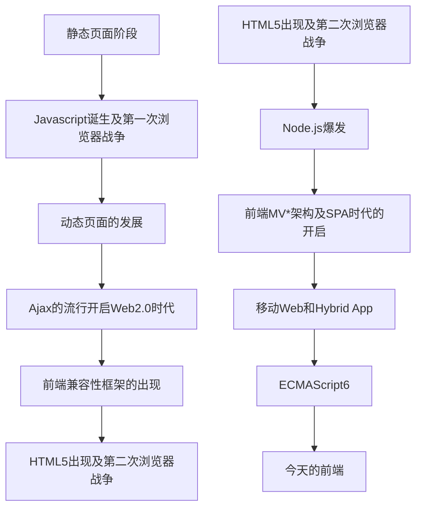
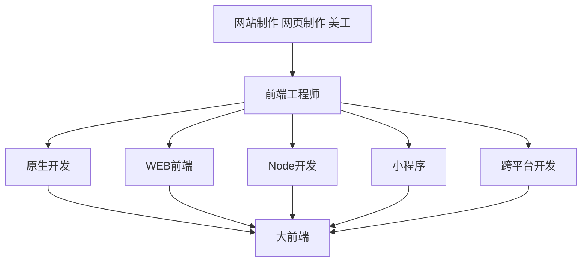

title: 前端工程师的“自我介绍” 
speaker: liqiaojun
prismTheme: dark
plugins:
    - echarts
    - mermaid: {theme: forest}

<slide class="bg-black-blue aligncenter" image="https://source.unsplash.com/C1HhAQrbykQ/ .dark">

# 前端工程师的“自我介绍”  {.text-landing.text-shadow}
 
By 李乔军 {.text-intro}

开放平台产品群-平台业务线-On Store {.text-intro}

<slide class="bg-black-blue aligncenter">

## 目标
 
* 了解前端的发展
* 深入了解前端的工作内容
* 更加默契的合作

<slide class="bg-black-blue aligncenter">

#### 历史大事件

<slide class="bg-black-blue aligncenter">

#### 前端职位发展

<slide class="bg-black-blue aligncenter">

#### 技术栈发展
 
* 工具库集合类  JQeery
* 模块化工具   requireJS, seaJS
* MV*架构   React, VUE, Angular
* UI组件类 antd, element ui
* 后端开发框架  express, KOA, Toa, deno
* 原生开发  IOS, Android
* 跨平台解决方案 RN, flutter, Taro

<slide class="bg-black-blue aligncenter">

<slide class="bg-black-blue aligncenter">

#### 前端需求来源

<slide class="bg-black-blue aligncenter">

#### 前端工作流程

<slide class="bg-black-blue aligncenter">

#### 其他基础建设
 
* 掌握行业前沿技术，对项目进行改革
* 模块化，组件化，复用
* 自动化部署，工程化构建
* 性能优化

<slide class="bg-black-blue aligncenter">

#### 总结
 
比美工懂技术，比技术懂交互 
文，可影响网站产品运营和盈利 
武，可深达网站产品设计与研发

<slide class="bg-black-blue aligncenter">

# 谢谢